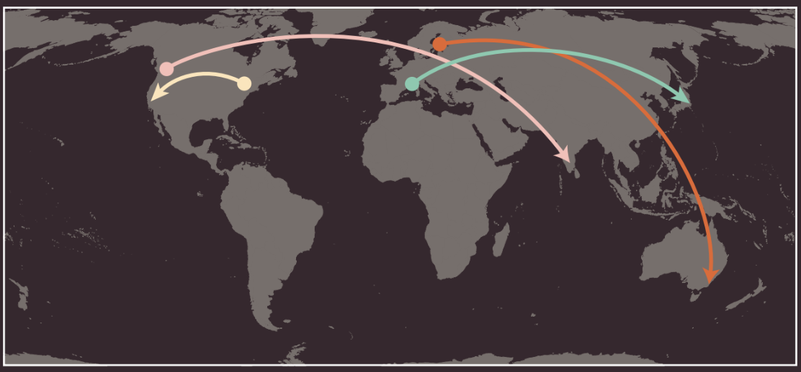

# How Websites are Created

## What you see

When you are looking at a website, it's most likely that your browser will be receiving HTML and CSS from the web server that hosts the site. The web browser interprets the HTML and CSS code to create the page that you see.

# How the web works

When you visit a website, the web server hosting that site could be anywhere in the world. To find the location of the web server, your browser will first connect to a Domain Name System (DNS) server.

1. When you connect to the web, you do so via an **Internet Service Provider** (ISP). You type a domain name or web address into your browser to visit a site; for example google.com, bb.co.uk, microsoft.com.
2. Your computer contacts a network of servers called **Domain Name System** (DNS) servers. These act like phone books; they tell your computer the IP address associated with the requested domain name.
An IP address is a number of up to 12 digits separated by periods/full stops. Every device connected to the web has a unique IP address.
3. The unique number that the DNS server returns to your computer allows your browser to contact the web server that hosts the website you requested. A web server is a computer that is constantly connected to the web, and is set up especially to send web pages to users.
4. The web server then sends the page you requested back to your web browser.