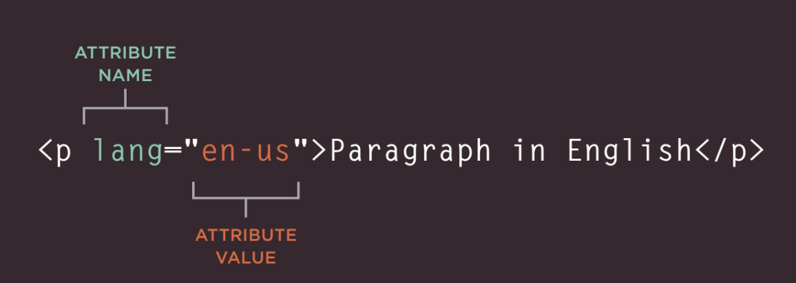

# HTML describes the structure of pages
``````
<html>
    <body>
        <h1>This is the Main Heading</h1>
        <p>This text might be an introduction to the rest of
        the page. And if the page is a long one it might
        be split up into several sub-headings.<p>
        <h2>This is a Sub-Heading</h2>
        <p>Many long articles have sub-headings so to help
        you follow the structure of what is being written.
        There may even be sub-sub-headings (or lower-level
        headings).</p>
        <h2>Another Sub-Heading</h2>
        <p>Here you can see another sub-heading.</p>
    </body>
</html>
``````

The HTML code has characters that live inside angled brackets - these are called HTML **elements**. Elements are usually made up of two tags: an opening tag and a closing tag.

## HTML USES ELEMENTS TO DESCRIBE THE STRUCTURE OF PAGES

Tags act like containers. They tell you something about the information that lies between their opening and closing tags.

The characters in the brackets indicate the tag's purpose.

The terms "tag" and "element" are often used interchangeably.

### Attributes tell us more about elements

Attributes provide additional information about the contents of an element. They appear on the opening tag of the element and are made up of two parts: a **name** and a **value**, separated by equals sign.



The attribute **name** indicates what kind of extra information you are supplying about the element's content. It should be written in lowercase.

The **value** is the information or setting for the attribute. It should be placed in double quotes.

## BODY, HEAD & TITLE

### ```<body>```

Everything inside this element is shown inside the main browser window.

###  ```<head>```

Goes before the ```<body>``` element. It contains information about the page, you should find a ```<title>``` element inside ```<head>``` element.

###  ```<title>```

The content of the ```<title>``` element are either shown in the top of the browser, above where you usually type in the URL of the page you want to visit, or on the tab for that page

You may know that HTML stands for HyperText Markup Language. The HyperText part refers to the fact that HTML allows you to create links that allow visitors to move from one page to another quickly and
easily.